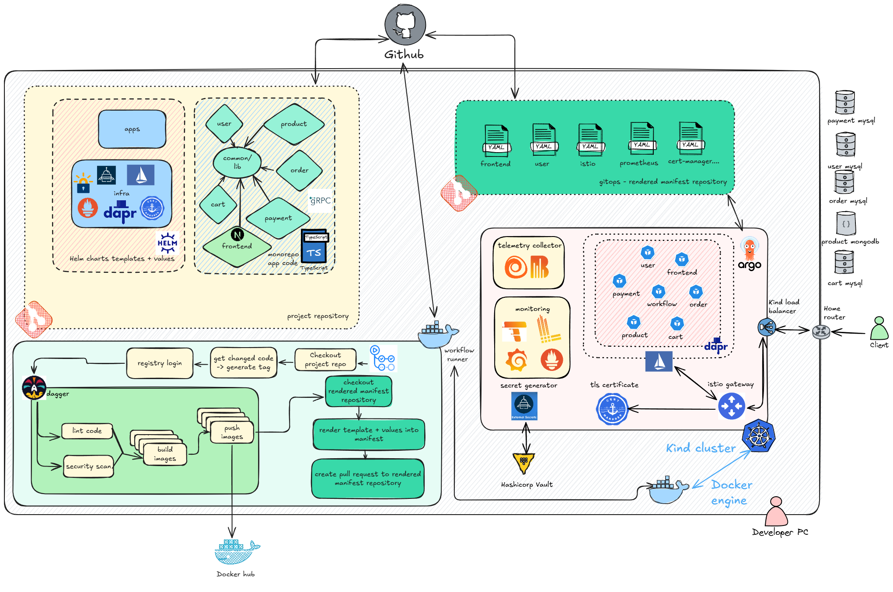

# Nexura Ecommerce Platform



## Overview
Nexura Ecommerce is a modern, cloud-native, microservices-based e-commerce platform. It leverages a robust set of technologies for scalability, developer productivity, and operational excellence. This project is designed for local development with a production-like Kubernetes experience, powered by GitOps and automated CI/CD.

## Architecture
- **Microservices**: Each business domain (user, product, order, cart, payment, workflow, frontend) is implemented as an independent service, written in TypeScript and managed as a monorepo.
- **Frontend**: Built with Next.js and React, styled with Tailwind CSS, and using modern UI libraries (Radix UI, Lucide, etc.).
- **API Communication**: Services communicate via gRPC and REST, with shared protobuf definitions and a common package for types/utilities.
- **Databases**: Each service uses its own database (MySQL for most, MongoDB for product), supporting data isolation and scaling.
- **Infrastructure as Code**: Helm charts manage Kubernetes manifests for all services and infrastructure (Istio, Dapr, monitoring, secrets, etc.).
- **Observability**: Integrated with Grafana, Prometheus, Loki, and Tempo for monitoring, logging, and tracing.
- **Security & Secrets**: Uses HashiCorp Vault and Kubernetes External Secrets for secure secret management.
- **Service Mesh**: Istio provides secure service-to-service communication, ingress, and traffic management.
- **Eventing/State**: Dapr sidecars enable state management, pub/sub, and bindings for microservices.

## Key Technologies
- **Languages/Runtimes**: TypeScript, Bun (JS/TS runtime).
- **Frontend**: Next.js, React, Tailwind CSS
- **Backend**: gRPC, REST, Prisma ORM
- **Service Mesh**: Istio
- **Distributed Application Runtime**: Dapr
- **CI/CD**: GitHub Actions, Dagger, Docker, SOPS, Helm
- **Kubernetes**: Kind (local cluster), Helm, ArgoCD (GitOps)
- **Monitoring/Tracing**: Prometheus, Grafana, Loki, Tempo
- **Secrets Management**: HashiCorp Vault, External Secrets Operator
- **Container Registry**: Docker Hub

## Monorepo Structure
- `src/` — Microservices (user, product, order, cart, payment, workflow, frontend)
- `packages/` — Shared code, gRPC gateway, linting, etc.
- `deployments/helm-charts/` — Helm charts for all services and infra
- `.github/workflows/` — CI/CD pipelines (build, lint check, secret check, push images, deploy manifests)
- `.dagger/` — Dagger pipeline definitions for advanced CI/CD

## Development Workflow
1. **Code Changes**: Developers work on services or frontend in the monorepo.
2. **CI/CD Pipeline**: On push/PR, GitHub Actions + Dagger build and scan images, push to Docker Hub, and update manifests.
3. **GitOps**: Rendered manifests are PR'd to a separate repo, which ArgoCD uses to sync the Kind (Kubernetes) cluster.
4. **Local Dev**: Run a full production-like stack locally using Kind, Helm, and Docker.
5. **Observability**: Access Grafana, Prometheus, and other dashboards for monitoring.

## Getting Started

### Local Development
1. **Install dependencies**
   ```bash
   bun install
   ```
2. **Run all services locally with Dapr**
   ```bash
   dapr run -f .
   ```
   This will launch all microservices defined in the Dapr configuration for local development.

### Local Deployment (Kubernetes)
Use the `justfile` recipes to provision and deploy the full stack to a local Kubernetes (Kind) cluster:

1. **Provision and setup infrastructure**
   ```bash
   just kind         # Create Kind cluster
   just helm-infra   # Deploy infrastructure components (Istio, Dapr, monitoring, etc.)
   just helm-app     # Deploy all application services
   ```
2. **(Optional) Install ArgoCD for GitOps**
   ```bash
   just install-argo
   just argo         # Forward ArgoCD dashboard
   ```

See the `justfile` for more advanced recipes and automation steps.

## References
- See the architecture diagram above for a high-level overview of the platform.
- For more details, see the `deployments/helm-charts/` and each service's README or source code.

---

> This project was bootstrapped with Bun v1.2.8. See [Bun](https://bun.sh) for more info.
