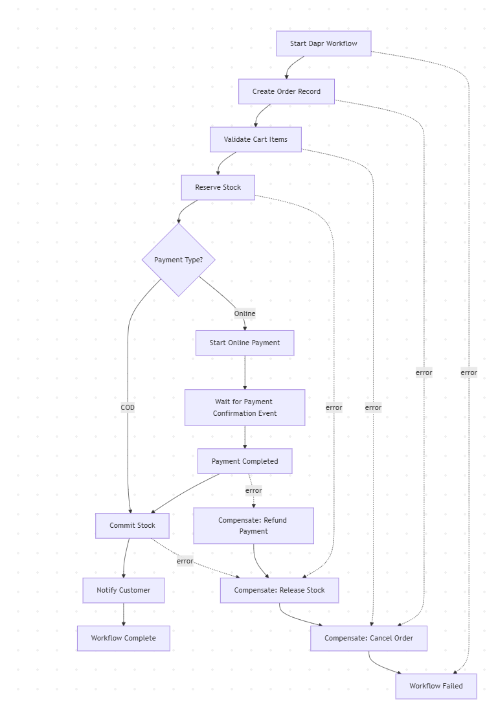

# daprOrderProcessingWorkflow

### Handles the order processing flow with payment options and error handling.

---

Initial Scaffold generated with Dapr [Workflow Composer](https://workflows.diagrid.io) by [](https://diagrid.io)

_Version_: `v0.0.20`

---

## 🧭 Workflow Diagram

[](DaprOrderProcessingWorkflow.png)

---

## 🚀 Get Started in 3 Steps

### 1️⃣ Install Prerequisites

   - [Node.js 18 or later](https://nodejs.org/)
   - [Dapr CLI](https://docs.dapr.io/getting-started/install-dapr-cli/) version 1.15 or later
   - [Docker](https://www.docker.com/products/docker-desktop) (for running Dapr components)

   ```bash
   # Check Dapr version
   dapr --version
   ```

   Make sure the version is 1.15 or later for CLI and Runtime.

   If you haven't initialized Dapr before, run:

   ```bash
   # If new to Dapr
   dapr init
   ```

### 2️⃣ Run the Workflow App

   ```bash
   # Install dependencies
   npm install

   # Start all apps defined in dapr.yaml (runs in foreground)
   dapr run -f .
   ```

### 3️⃣ Start the Workflow

 In a new terminal, start a workflow using the Dapr [Workflow API](https://docs.dapr.io/reference/api/workflow_api/):

   With cURL:

   ```bash
   # Note: Wait a moment for the application to start before running this
   curl -X POST http://localhost:3684/v1.0/workflows/dapr/daprOrderProcessingWorkflow/start \
     -H "Content-Type: application/json" \
     -d '{ 
       "data": {
          "payment_type_online": true
       }
     }'
   ```

   On Windows, you can use the `Invoke-WebRequest` cmdlet instead of curl (or use curl.exe that is usually available in Windows Terminal or Git Bash):

   ```powershell
   Invoke-WebRequest -Method POST -Uri http://localhost:3684/v1.0/workflows/dapr/daprOrderProcessingWorkflow/start `
     -ContentType "application/json" `
     -Body '{"data":{ "payment_type_online": true } }'
   ```

   See the [Decision Points Reference](#decision-points-reference) section below for all available decision points and their descriptions, including mutually exclusive options.

### 🔍 Check your workflow status

  With cURL:

  ```bash
  # Using Dapr direct Workflow API
  curl -s http://localhost:3684/v1.0/workflows/dapr/<instance-id>
  ```

  On Windows:

  ```powershell
  # Check workflow status in PowerShell:
  Invoke-WebRequest -Uri http://localhost:3684/v1.0/workflows/dapr/<instance-id>
  ```
### 📡 Triggering External Events

  This workflow listens for specific external events to proceed at certain points.

  | 🧠 Event Meaning  | 🏷️ Event Label |
  |--------------------|----------------|
  |Payment Confirmed|payment_confirmation_received|

   With cURL:

   ```bash
   # Use the instance id from the workflow status check above
   curl -X POST http://localhost:3684/v1.0/workflows/dapr/<instance-id>/raiseEvent/payment_confirmation_received \
     -H "Content-Type: application/json" \
     -d '{"approve": true}'
   ```

   On Windows:

   ```powershell
   # Start a workflow in PowerShell:
   Invoke-WebRequest -Method POST -Uri http://localhost:3684/v1.0/workflows/dapr/<instance-id>/raiseEvent/payment_confirmation_received `
     -ContentType "application/json" `
     -Body '{"data":{"approve": true}}'
   ```

---

## Detailed Documentation

## Overview

This application implements a Dapr workflow using Node.js and the Dapr workflow SDK. It demonstrates how to:

- Define a workflow using the Dapr Workflow SDK
- Use a unified data model for workflow state
- Handle conditions and branching
- Expose a REST API for workflow management

## Workflow Determinism

Any non-deterministic code should go into activities. This includes, calling other (Dapr) services, state stores, pub/sub systems, and external endpoints. The workflow should only be responsible for the business logic that defines the sequence of the activities.

The Dapr workflow engine replays workflows multiple times during execution, so workflow code must behave consistently on each replay. Activities are the appropriate place for operations with side effects or external dependencies.

## Data Flow Architecture

The workflow uses a simple `WorkflowState` object to manage state throughout the entire execution.
It keeps track of activity history and allows for easy access to the data needed for the next activity.

If you start the process with the environment variable `DEBUG=true`, it will keep a history of all the activities and their results.
This is useful for debugging and understanding the flow of data through the workflow.

### Decision Points Reference

This workflow contains several decision points that determine the flow of execution.

You can customize by setting specific values in the `WorkflowState`.

Decision points are in most cases mutually exclusive - only one should be set to `true`.

--- 

**Decision Point 'Implicit exclusive branching for activity validate_cart_items'**

Choose one of:

| Decision Point | Property Key | Example Use |
|----------------|--------------|-------------|
| Implicit exclusive branching for activity validate_cart_items | `` | `workflowState.data[""] = true` |
| Implicit exclusive branching for activity validate_cart_items | `` | `workflowState.data[""] = true` |

--- 

**Decision Point 'Implicit exclusive branching for activity create_order_record'**

Choose one of:

| Decision Point | Property Key | Example Use |
|----------------|--------------|-------------|
| Implicit exclusive branching for activity create_order_record | `` | `workflowState.data[""] = true` |
| Implicit exclusive branching for activity create_order_record | `` | `workflowState.data[""] = true` |

--- 

**Decision Point 'Implicit exclusive branching for activity reserve_stock'**

Choose one of:

| Decision Point | Property Key | Example Use |
|----------------|--------------|-------------|
| Implicit exclusive branching for activity reserve_stock | `` | `workflowState.data[""] = true` |
| Implicit exclusive branching for activity reserve_stock | `` | `workflowState.data[""] = true` |

--- 

**Decision Point 'Determines the payment method to use.'**

Choose one of:

| Decision Point | Property Key | Example Use |
|----------------|--------------|-------------|
| Determines the payment method to use. | `payment_type_online` | `workflowState.data["payment_type_online"] = true` |
| Determines the payment method to use. | `payment_type_cod` | `workflowState.data["payment_type_cod"] = true` |

--- 

**Decision Point 'Implicit exclusive branching for activity wait_for_payment_confirmation'**

Choose one of:

| Decision Point | Property Key | Example Use |
|----------------|--------------|-------------|
| Implicit exclusive branching for activity wait_for_payment_confirmation | `` | `workflowState.data[""] = true` |
| Implicit exclusive branching for activity wait_for_payment_confirmation | `` | `workflowState.data[""] = true` |

--- 

**Decision Point 'Implicit exclusive branching for activity payment_completed'**

Choose one of:

| Decision Point | Property Key | Example Use |
|----------------|--------------|-------------|
| Implicit exclusive branching for activity payment_completed | `` | `workflowState.data[""] = true` |
| Implicit exclusive branching for activity payment_completed | `` | `workflowState.data[""] = true` |

--- 

**Decision Point 'Implicit exclusive branching for activity commit_stock'**

Choose one of:

| Decision Point | Property Key | Example Use |
|----------------|--------------|-------------|
| Implicit exclusive branching for activity commit_stock | `` | `workflowState.data[""] = true` |
| Implicit exclusive branching for activity commit_stock | `` | `workflowState.data[""] = true` |

Example of starting a workflow with one decision point:
```bash
curl -X POST http://localhost:3684/v1.0/workflows/dapr/daprOrderProcessingWorkflow/start \
  -H "Content-Type: application/json" \
  -d '{"data":{ "payment_type_online": true }}'
```

### Benefits and Limitations of the Data Model

#### Benefits for Getting Started:
1. **Simplified Data Flow**: A single object flows through the workflow, making it easy to trace data.
2. **Dynamic Properties**: Using helper functions like `getValue()` and `addData()` allows flexible data storage.
3. **Easy Parallel Handling**: A unified structure simplifies merging results from parallel branches.
4. **Minimal Code Generation**: Reduces the need to generate many specialized classes.

#### Limitations for Production Use:
1. **Limited Type Safety**: Using string keys with dynamic data reduces type checking.
2. **No Schema Validation**: No built-in validation for required properties or data formats.
3. **Reduced Readability**: Less clarity about what data each activity actually needs.
4. **Performance Overhead**: Dynamic serialization/deserialization has some overhead.

For production systems, consider evolving toward domain-specific models that better represent your business entities.


#### Tips for Effective Data Handling

1. **Use TypeScript**: Add type definitions for better type safety and IDE assistance
2. **Consider input validation**: Validate data before passing it to activities
3. **Leverage immutability**: Create new objects instead of modifying existing ones
4. **Add structured logging**: Use consistent logging patterns with appropriate context for better debugging

## Customization Guidelines

### Adapting the Unified Data Model

The generated workflow uses a simplified approach with a single `WorkflowState` object that flows through all activities. While this is convenient for getting started, you may want to adapt it for real-world scenarios:

1. **Domain-Specific Models**: Replace the generic `WorkflowState` with your domain entities
   ```javascript
   class OrderProcessing {
     constructor() {
       this.input = {};
       this.result = {};
     }
   }
   ```

2. **Activity-Specific Types**: Define input/output types for each activity
   ```javascript
   async function verifyInventoryActivity(context, input) {
     // Extract what this activity needs
     const productId = input.data.productId;
     if (!productId) {
       throw new Error('Missing required field: productId');
     }

     // Business logic here
     // ...

     return result;
   }
   ```

3. **Custom Business Logic**: Replace the generic activity implementations with your actual business logic
   ```javascript
   // Instead of:
   if (workflowState.data.has_inventory)

   // Use domain-specific logic:
   const hasStock = await inventoryService.hasStock(orderDetails.productId, orderDetails.quantity);
   if (hasStock) {
     // Process order
   }
   ```

### Conditional Logic Improvements

The generated workflow uses simple boolean conditions via `getBool()` for simplicity. In production code:

1. Replace these with proper domain logic
2. Use strongly-typed properties instead of the dynamic dictionary
3. Add validation and error handling for conditional flows

Example transformation:
```javascript
// Generated code:
if (getBool(workflowState, 'is_approved'))

// Production code:
const approved = await approvalService.validateApproval(request.orderId, workflowExecution.instanceId);
if (approved) {
  // Handle approval logic
}
```

### Handling Complexity

For more complex workflows:

1. Break large workflows into smaller sub-workflows
2. Add robust error handling and compensation logic
3. Implement observability through structured logging and metrics
4. Consider versioning strategies for long-running workflows

## Project Structure

```
.
├── 🛠 package.json         # Node.js dependencies and scripts
├── 📄 README.md            # This documentation file
├── 🧩 components/          # Dapr component configurations
│   ├── pubsub.yaml         # Message broker/pub-sub component
│   └── statestore.yaml     # State store component
├── 🖥️ src/                 # Source code directory
│   ├── app.js              # Application entry point
│   ├── activities/         # Individual activity implementations
│   │   └── *.js            # Activity implementation files
│   ├── models/             # Data models
│   │   ├── activity-response.js # Activity response model
│   │   ├── workflow-data.js     # Workflow data model
│   │   └── workflow-result.js   # Workflow result model
│   └── workflow/           # Core workflow implementation
│       └── index.js        # Main workflow definition
└── 🐳 Dockerfile           # Container definition
```


---

Initial Scaffold generated with Dapr [Workflow Composer](https://workflows.diagrid.io) by [](https://diagrid.io)

_Version_: `v0.0.20`